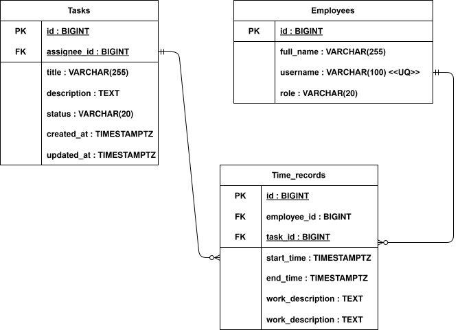
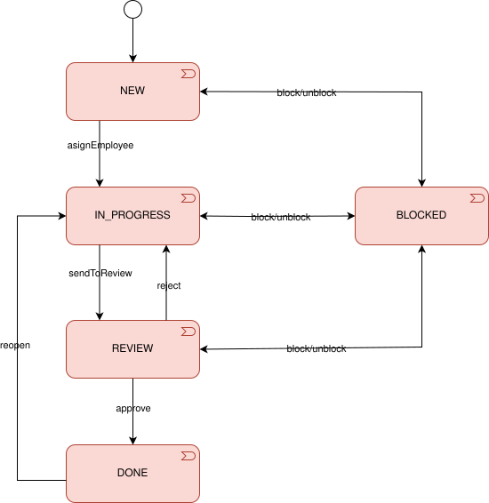
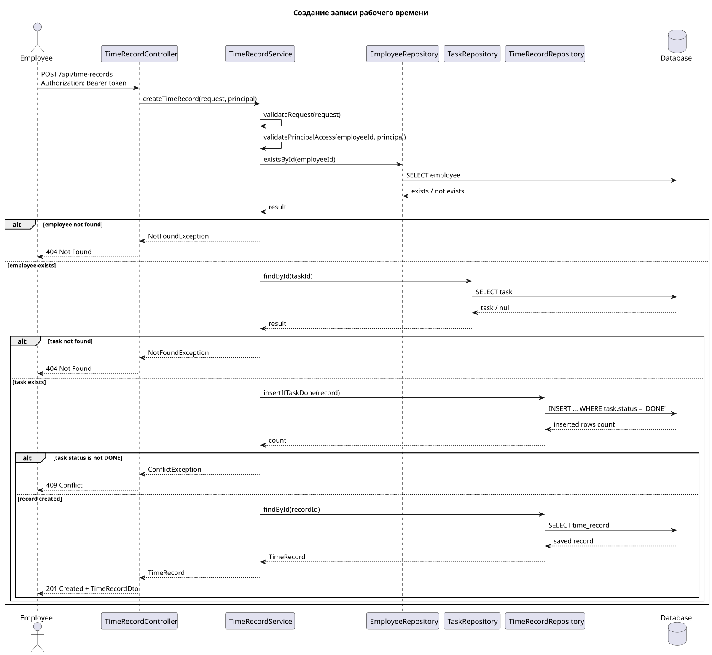

# Task Time Tracker


Backend REST-сервис для учета рабочего времени сотрудников по задачам.

Сервис позволяет:

- авторизоваться через JWT;
- создавать, смотреть, обновлять и назначать задачи;
- менять статус задачи;
- фиксировать временные отрезки по выполненным задачам.

Быстрый запуск:

```bash
docker compose up -d
./mvnw spring-boot:run
```

- API: `http://localhost:8080`
- Минимальный UI: `http://localhost:8080/ui`
- Swagger UI: `http://localhost:8080/swagger-ui/index.html`
- OpenAPI JSON: `http://localhost:8080/v3/api-docs`

## Функциональность

- JWT-аутентификация.
- Роли пользователей: `ADMIN`, `EMPLOYEE`.
- CRUD-операции для задач без удаления: создание, чтение, обновление.
- Фильтрация задач по `assigneeId` и `status`.
- Назначение исполнителя.
- Изменение статуса задачи.
- Создание записи рабочего времени.
- Проверка бизнес-правила: time record создается только для задачи в статусе `DONE`.
- Ограничение доступа: сотрудник не может создать запись времени за другого сотрудника.
- Минимальный UI на Thymeleaf для ручной проверки без Postman.
- Валидация входных данных.
- Единый формат ошибок API.

Особенности реализации:

- Многоуровневая архитектура: `Controller -> Service -> Repository`.
- SQL явно описан в MyBatis XML mapper'ах.
- Правило `TimeRecord` только для `DONE`-задачи защищено атомарным `INSERT ... WHERE EXISTS`.
- Централизованная обработка ошибок через `@RestControllerAdvice`.

## API

Все endpoint'ы, кроме `/api/auth/**`, требуют:

```http
Authorization: Bearer <accessToken>
```

### auth-controller

| Method | Endpoint | Описание |
| --- | --- | --- |
| `POST` | `/api/auth/login` | Получить JWT |

Тестовые пользователи:

| Логин | Пароль | Роль |
| --- | --- | --- |
| `admin` | `password` | `ADMIN` |
| `employee` | `password` | `EMPLOYEE` |

### task-controller

| Method | Endpoint | Описание |
| --- | --- | --- |
| `POST` | `/api/tasks` | Создать задачу |
| `GET` | `/api/tasks` | Получить задачи, фильтры: `assigneeId`, `status` |
| `GET` | `/api/tasks/{id}` | Получить задачу |
| `PUT` | `/api/tasks/{id}` | Обновить задачу |
| `PATCH` | `/api/tasks/{id}/status` | Изменить статус |
| `PATCH` | `/api/tasks/{id}/assignee` | Назначить исполнителя |

Статусы: `NEW`, `IN_PROGRESS`, `REVIEW`, `DONE`, `BLOCKED`.

### time-record-controller

| Method | Endpoint | Описание |
| --- | --- | --- |
| `POST` | `/api/time-records` | Создать запись рабочего времени |

## Запуск локально
### База данных
```bash
docker compose up -d
```
### Приложение

```bash
./mvnw spring-boot:run
```

После запуска:

- UI: `http://localhost:8080/ui`
- REST API: `http://localhost:8080`
- Swagger UI: `http://localhost:8080/swagger-ui/index.html`
- OpenAPI JSON: `http://localhost:8080/v3/api-docs`

UI нужен только для быстрой ручной проверки: login, список задач, создание задачи, смена статуса, назначение исполнителя, создание записи времени.

## Тестовые запросы

Postman collection:

```text
docs/postman/task-time-tracker.postman_collection.json
```

## Проектирование

### Сущности

Сначала определялись ключевые сущности системы. По ТЗ было решено сделать упрощенно две роли: Employee (работник) и Admin (администратор). Со временем архитектура расширялась:
- Employee – сотрудник с логином, паролем и ролью.
- Task – задача с исполнителем, автором, статусом, датами создания и обновления.
- TimeRecord – запись о времени, затраченном на задачу.
- Role – роли пользователей: ADMIN, EMPLOYEE.
- Status – состояния задач: NEW, IN_PROGRESS, REVIEW, DONE, BLOCKED.



Файл: [docs/diagramms/ER.drawio.svg](docs/diagramms/ER.drawio.svg)

### Состояния задач
Изначально задачи имели базовые статусы (NEW, DONE), но для более гибкого учета работы было решено расширить состояния: IN_PROGRESS, REVIEW, BLOCKED. Это позволяет лучше отслеживать жизненный цикл задачи и контролировать, когда можно фиксировать время.




Файл: [docs/diagramms/task-state.drawio.svg](docs/diagramms/task-state.drawio.svg)

### Правила создания временных записей

Решение о том, когда можно создать запись времени (TimeRecord), принималось исходя из логики работы сотрудников:

В записи фиксируется результат проделанной работы.
Первоначально планировалось добавлять запись только после завершения задачи (DONE).
Рассматривался вариант фиксирования времени на этапах IN_PROGRESS и REVIEW, но для упрощения и удобства тестирования было решено ограничиться записью после завершения задачи.



PlantUML-файл: [docs/diagramms/sequence-time-record.svg](docs/diagramms/sequence-time-record.svg)]

### Архитектура

Слои проекта:

- `api` - REST-контроллеры.
- `dto` - входные и выходные модели API.
- `service` - бизнес-логика и проверки доступа.
- `repository` - MyBatis repository.
- `resources/mappers` - SQL-запросы.
- `mapper` - преобразование entity в DTO.
- `exception` - исключения и единый ответ ошибки.
- `auth` - JWT и Spring Security.
- `ui` - минимальные Thymeleaf-страницы для ручной проверки.

Валидация:

- DTO: `@NotBlank`, `@NotNull`, `@Positive`, `@Size`.
- Service: бизнес-правила, права доступа, корректность временного интервала.


## Тестирование

В рамках проекта были проведены следующие проверки:

- Интеграционные тесты DAO-слоя с взаимодействием с PostgreSQL через Testcontainers.
- Unit и интеграционные тесты охватывают основные сервисы и контроллеры, общий coverage превышает 90%.
- Сценарии использования были проверены на основе документа [use-case-tables.md](docs/use-case-tables.md). 
- API-тестирование через Postman: реализованы основные сценарии, которые можно проверить, импортировав коллекцию: [task-time-tracker.postman_collection.json](docs/postman/task-time-tracker.postman_collection.json).

### Покрытие тестами по Use Cases
| Use Case                      | Unit tests | Integration/API tests |
| ----------------------------- | ---------- | --------------------- |
| *место для добавления данных* |            |                       |

Существующие тесты: 
- Service layer: AuthServiceTest, TaskServiceTest, TimeRecordServiceTest
- Auth/Security: JwtProviderTest, SecurityFiltersTest
- Exception handling: ApiExceptionHandlerTest
- Mapper: MapperTest, TimeRecordMapperTests
- REST controllers: RestControllerMockitoIntegrationTest
- Application context: TaskTimeTrackerApplicationTests
- PostgreSQL integration через Testcontainers

Запуск:

```bash
./mvnw test
```

HTML-отчет

После выполнения тестов можно открыть отчет:
```text
htmlReport/index.html
```

## Использование ИИ

ИИ использовался как помощник:

- для обсуждения архитектуры;
- проверки edge cases;
- идей для тестовых сценариев;
- формулирования README.

Артефакты:

- screenshots: TODO
- ai-notes: TODO

TODO:

- добавить описание тестов и как их запускать
- добавить артефакты взаимодействия с ИИ
- обновить ui чтобы верно отображался. Нужно проверить правильность реализации. не видно записи времени.
- проверить такая ли диаграмма состояния таск. Действительно такие переходы например из done куда можем перейти. т.е. проверить возможность этих переходов. И если не можем, то поменять. И добавить в диаграмму состояния таск статус review, который может быть между in_progress и done. И добавить переходы из in_progress в review и из review в done.
- запустить на серваке оставить публичный доступ и добавить ссылку в README
- проверить запуск по интрукции в ридми. И если что-то не работает, то исправить инструкцию и/или код, чтобы все работало по инструкции. И добавить в ридми инструкцию по запуску тестов и генерации отчета.
- проверить, что все требования из задания выполнены. И если что-то не выполнено, то реализовать эту функциональность.