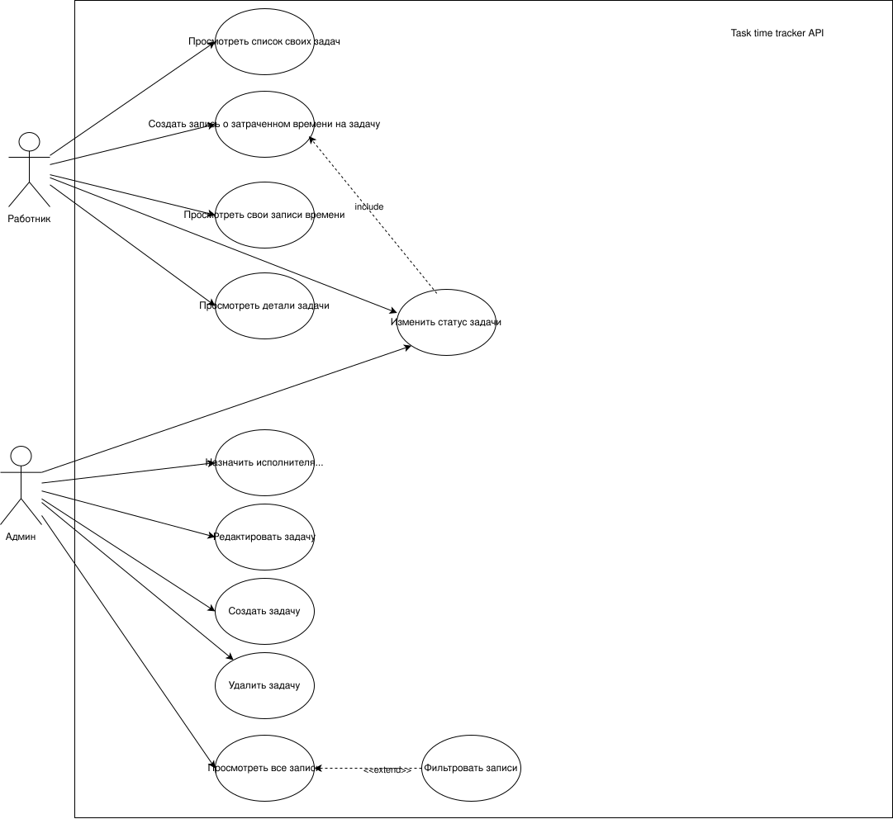
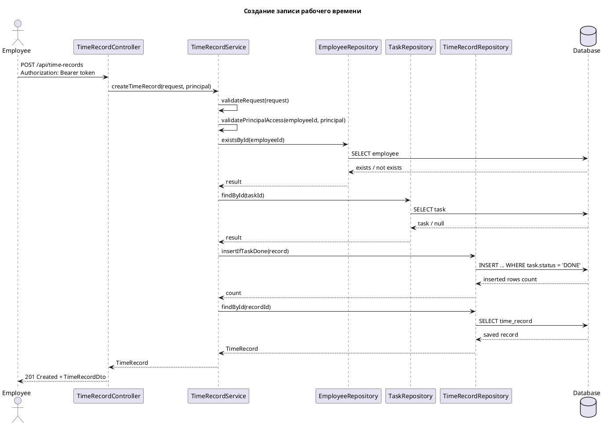

# Task Time Tracker

Backend REST-сервис для учета рабочего времени сотрудников по задачам.

Сервис позволяет:

- авторизоваться через JWT;
- создавать, смотреть, обновлять и назначать задачи;
- менять статус задачи;
- фиксировать временные отрезки по выполненным задачам.

Стек: Java 21, Spring Boot 3.4, Spring Web, Spring Security, JWT, MyBatis, PostgreSQL, Thymeleaf, JUnit 5, Mockito, Testcontainers, Maven.

Быстрый запуск:

```bash
docker compose up -d
./mvnw spring-boot:run
```

- API: `http://localhost:8080`
- Минимальный UI: `http://localhost:8080/ui`
- Swagger UI: `http://localhost:8080/swagger-ui/index.html`
- OpenAPI JSON: `http://localhost:8080/v3/api-docs`

## Функциональность

- JWT-аутентификация.
- Роли пользователей: `ADMIN`, `EMPLOYEE`.
- CRUD-операции для задач без удаления: создание, чтение, обновление.
- Фильтрация задач по `assigneeId` и `status`.
- Назначение исполнителя.
- Изменение статуса задачи.
- Создание записи рабочего времени.
- Проверка бизнес-правила: time record создается только для задачи в статусе `DONE`.
- Ограничение доступа: сотрудник не может создать запись времени за другого сотрудника.
- Минимальный UI на Thymeleaf для ручной проверки без Postman.
- Валидация входных данных.
- Единый формат ошибок API.

Инженерные решения:

- Разделение слоев: `Controller -> Service -> Repository`.
- DTO отделены от entity.
- SQL явно описан в MyBatis XML mapper'ах.
- Правило `TimeRecord` только для `DONE`-задачи защищено атомарным `INSERT ... WHERE EXISTS`.
- Централизованная обработка ошибок через `@RestControllerAdvice`.

## API

Все endpoint'ы, кроме `/api/auth/**`, требуют:

```http
Authorization: Bearer <accessToken>
```

### auth-controller

| Method | Endpoint | Описание |
| --- | --- | --- |
| `POST` | `/api/auth/login` | Получить JWT |

Тестовые пользователи:

| Логин | Пароль | Роль |
| --- | --- | --- |
| `admin` | `password` | `ADMIN` |
| `employee` | `password` | `EMPLOYEE` |

### task-controller

| Method | Endpoint | Описание |
| --- | --- | --- |
| `POST` | `/api/tasks` | Создать задачу |
| `GET` | `/api/tasks` | Получить задачи, фильтры: `assigneeId`, `status` |
| `GET` | `/api/tasks/{id}` | Получить задачу |
| `PUT` | `/api/tasks/{id}` | Обновить задачу |
| `PATCH` | `/api/tasks/{id}/status` | Изменить статус |
| `PATCH` | `/api/tasks/{id}/assignee` | Назначить исполнителя |

Статусы: `NEW`, `IN_PROGRESS`, `REVIEW`, `DONE`, `BLOCKED`.

### time-record-controller

| Method | Endpoint | Описание |
| --- | --- | --- |
| `POST` | `/api/time-records` | Создать запись рабочего времени |

## Запуск локально
### База данных
```bash
docker compose up -d
```
### Приложение

```bash
./mvnw spring-boot:run
```

После запуска:

- UI: `http://localhost:8080/ui`
- REST API: `http://localhost:8080`
- Swagger UI: `http://localhost:8080/swagger-ui/index.html`
- OpenAPI JSON: `http://localhost:8080/v3/api-docs`

UI нужен только для быстрой ручной проверки: login, список задач, создание задачи, смена статуса, назначение исполнителя, создание записи времени.

## Тестовые запросы

Postman collection:

```text
docs/postman/task-time-tracker.postman_collection.json
```

## Архитектура

Сущности:

- `Employee` - сотрудник, логин, пароль, роль.
- `Task` - задача, статус, исполнитель, автор, даты создания и обновления.
- `TimeRecord` - запись времени по сотруднику и задаче.
- `Role` - `ADMIN`, `EMPLOYEE`.
- `Status` - `NEW`, `IN_PROGRESS`, `REVIEW`, `DONE`, `BLOCKED`.

Слои проекта:

- `api` - REST-контроллеры.
- `dto` - входные и выходные модели API.
- `service` - бизнес-логика и проверки доступа.
- `repository` - MyBatis repository.
- `resources/mappers` - SQL-запросы.
- `mapper` - преобразование entity в DTO.
- `exception` - исключения и единый ответ ошибки.
- `auth` - JWT и Spring Security.
- `ui` - минимальные Thymeleaf-страницы для ручной проверки.

Валидация:

- DTO: `@NotBlank`, `@NotNull`, `@Positive`, `@Size`.
- Service: бизнес-правила, права доступа, корректность временного интервала.

Ошибки:

- `400` - некорректный запрос.
- `401` - нет авторизации.
- `403` - нет доступа.
- `404` - сущность не найдена.
- `409` - конфликт бизнес-правила.
- `500` - внутренняя ошибка.

## Диаграммы

### Use Case diagram



Файл: [docs/diagramms/usecase.drawio.svg](docs/diagramms/usecase.drawio.svg)

### ER diagram


Файл: [docs/diagramms/ER.drawio.svg](docs/diagramms/ER.drawio.svg)

### Task State diagram


Файл: [docs/diagramms/task-state.drawio.svg](docs/diagramms/task-state.drawio.svg)

### Sequence diagram

PlantUML-файл: [docs/diagramms/sequence-time-record.puml](docs/diagramms/sequence-time-record.puml)



## Тестирование

Есть тесты:

- service: `AuthServiceTest`, `TaskServiceTest`, `TimeRecordServiceTest`;
- auth/security: `JwtProviderTest`, `SecurityFiltersTest`;
- exception handling: `ApiExceptionHandlerTest`;
- mapper: `MapperTest`, `TimeRecordMapperTests`;
- REST: `RestControllerMockitoIntegrationTest`;
- application context: `TaskTimeTrackerApplicationTests`;
- PostgreSQL integration через Testcontainers.

Запуск:

```bash
./mvnw test
```

HTML-отчет:

```text
htmlReport/index.html
```

TODO: указать команду генерации отчета.

## Использование ИИ

ИИ использовался как помощник:

- для обсуждения архитектуры;
- проверки edge cases;
- идей для тестовых сценариев;
- формулирования README.

Артефакты:

- screenshots: TODO
- ai-notes: TODO